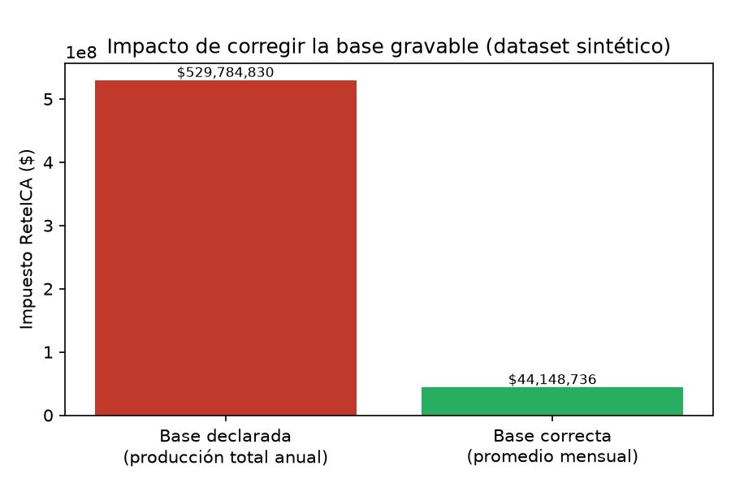

> ⚠️ **Nota sobre evidencias:**
> Por motivos de confidencialidad y políticas corporativas, no es posible publicar documentos, bases de datos ni soportes reales relacionados con este caso.
> La información presentada describe mi experiencia sin comprometer datos sensibles de la empresa. El script y los datos de este repositorio son sintéticos.

# Proyecto – Electrovichada ESP S.A.
**Rol:** Depurador Contable
**Periodo:** Enero 2023 – Abril 2023
**Proyecto:** Saneamiento contable y corrección de base tributaria – Segundo semestre 2022

## Contexto

Al ingresar a Electrovichada ESP S.A., la entidad presentaba inconsistencias significativas en la información contable del segundo semestre de 2022.
Existían saldos sin depurar, cuentas por conciliar y registros sin soporte adecuado, lo que afectaba la confiabilidad de los estados financieros
y el cumplimiento de las obligaciones fiscales.

Además, debido a la ausencia de un normograma que orientara correctamente la gestión tributaria, se evidenciaba una alta carga impositiva derivada
de errores en la base del impuesto de **ReteICA**, producto de una mala interpretación de la **Ley 56 de 1981**.
La empresa estaba calculando el impuesto sobre el total anual de producción de energía, cuando la norma establece que debe hacerse sobre el
promedio mensual de producción, lo que generó una inflación superior al **1000%** en el valor del tributo.

## Objetivo

Mi objetivo fue sanear la información contable del segundo semestre de 2022 y corregir la base de cálculo del impuesto de ReteICA, garantizando
que los saldos reflejaran la realidad financiera de la entidad y que la carga tributaria estuviera alineada con la normatividad vigente.

## ¿Qué hice?

De manera técnica y estructurada:

- Realicé conciliaciones complejas de caja, cuentas por cobrar, pasivos, inventarios y cuentas recíprocas.
- Depuré saldos inconsistentes y registros sin soporte.
- Validé la correcta causación de ingresos, costos y gastos.
- Analicé la base normativa del impuesto ReteICA según la Ley 56 de 1981.
- Recalculé el impuesto conforme al criterio legal correcto.
- Elaboré los Estados Financieros ajustados.

## ¿Cómo lo hice?

Apliqué criterios de:

- Depuración contable
- Análisis normativo
- Conciliación cruzada de información
- Verificación legal y tributaria

Trabajé con enfoque analítico, revisando cuenta por cuenta y documento por documento, y validando cada cálculo con base en la norma aplicable.

## Resultados

✔ Saneamiento completo de las cuentas del segundo semestre de 2022
✔ Corrección de la base del impuesto ReteICA
✔ Reducción de la carga impositiva a menos de la décima parte de lo que se venía liquidando (la base estaba inflada en más de un **1000%**): un ahorro de **~$300 millones** para la entidad
✔ Estados Financieros confiables para la toma de decisiones

## Herramienta: `auditor_reteica.py`

Para este portafolio automaticé, sobre un **dataset sintético**, el mismo tipo de auditoría que hice manualmente en este caso: detectar cuándo la
base gravable del ReteICA está calculada sobre la producción total anual en vez del promedio mensual, además de otros defectos de calidad de datos
típicos de un registro contable (duplicados, meses sin dato, montos atípicos).

```bash
pip install -r ../requirements.txt
python auditor_reteica.py
```

**Salida de ejemplo:**

```
Registros duplicados encontrados: 2
Meses con datos faltantes: 1
Montos atípicos (outliers): 1

Impuesto declarado (base incorrecta):  $529,784,830
Impuesto correcto (base según Ley 56):  $44,148,736
Inflación de la base gravable:          1100%
Ahorro potencial detectado:              $485,636,094
```



La cobertura de pruebas de este script (casos de prueba y bugs encontrados al probarlo como QA) está documentada en
[proyectos-personales/qa/electrovichada-auditor-reteica.md](../../proyectos-personales/qa/electrovichada-auditor-reteica.md).

## ¿Por qué este proyecto es importante?

Este proyecto demuestra mi capacidad para:

- Analizar información contable y normativa
- Detectar errores de alto impacto económico
- Corregir interpretaciones legales en procesos tributarios
- Aportar valor estratégico desde el rol contable

Aquí consolidé mi perfil como un profesional orientado a la **exactitud, el control y la calidad de la información financiera** — y este mismo
rigor es el que aplico como QA al probar mis propias herramientas.
