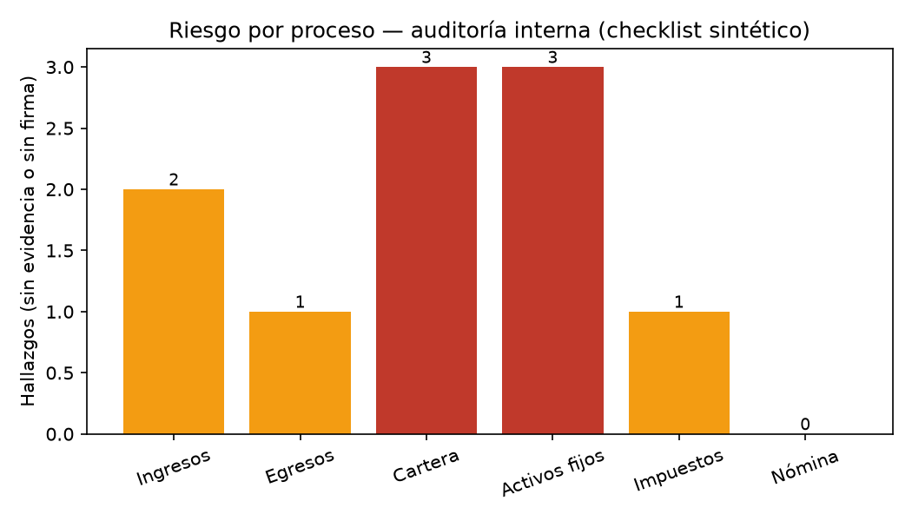

> ⚠️ **Nota sobre evidencias:**
> Por motivos de confidencialidad y políticas corporativas, no es posible publicar documentos, bases de datos ni soportes reales relacionados con este caso.
> La información presentada describe mi experiencia sin comprometer datos sensibles de la empresa. El script y los datos de este repositorio son sintéticos.

# Proyecto – FERVICOM S.A.S.

**Rol:** Contador Junior
**Periodo:** Octubre 2024 – Abril 2025
**Proyecto:** Auditoría y estandarización de procesos contables

## Contexto

Al ingresar a FERVICOM S.A.S., la empresa no contaba con auditorías formales sobre sus procesos contables y financieros.
Las actividades se ejecutaban de forma operativa, pero sin documentación clara, control estandarizado ni revisión sistemática,
lo que generaba riesgos en la confiabilidad de la información y en el cumplimiento normativo.

## Objetivo

Mi objetivo fue diseñar y ejecutar auditorías internas para todos los procesos contables, con el fin de evaluar su correcta ejecución,
identificar debilidades, mejorar controles y garantizar la consistencia de la información financiera.

## ¿Qué hice?

- Diseñé auditorías para los principales procesos contables: ingresos, egresos, cartera, activos fijos, impuestos y nómina.
- Revisé la correcta causación de operaciones contables.
- Validé soportes, conciliaciones y registros.
- Elaboré informes de hallazgos, riesgos y recomendaciones.
- Acompañé la implementación de mejoras en los procesos.

## ¿Cómo lo hice?

Apliqué criterios de:

- Control interno
- Auditoría contable
- Análisis de riesgos
- Revisión documental

Trabajé con enfoque preventivo, no solo corrigiendo errores, sino fortaleciendo los procesos para evitar fallas futuras.

## Resultados

✔ Procesos contables auditados y documentados
✔ Identificación de riesgos y puntos críticos
✔ Mejora en el control de la información financiera
✔ Mayor confiabilidad en los registros contables

## Herramienta: `auditor_checklist.py`

Para este portafolio automaticé, sobre un **checklist sintético** de 6 procesos contables (ingresos, egresos, cartera,
activos fijos, impuestos y nómina), el tipo de revisión que hice manualmente: valida que cada ítem marcado como
"Cumple" tenga evidencia adjunta y firma del responsable, detecta ítems duplicados y clasifica el riesgo por proceso.

```bash
pip install -r ../requirements.txt
python auditor_checklist.py
```

**Salida de ejemplo:**

```
Ítems duplicados en el checklist: 2
Marcados 'Cumple' sin evidencia adjunta: 6
Sin firma del responsable: 5
Sin responsable asignado: 0

Riesgo por proceso:
  Ingresos        Medio  (2 hallazgos)
  Egresos         Medio  (1 hallazgos)
  Cartera         Alto   (3 hallazgos)
  Activos fijos   Alto   (3 hallazgos)
  Impuestos       Medio  (1 hallazgos)
  Nómina          Bajo   (0 hallazgos)
```



La cobertura de pruebas de este script (casos de prueba y bugs encontrados al probarlo como QA) está documentada en
[proyectos-personales/qa/fervicom-auditor-checklist.md](../../proyectos-personales/qa/fervicom-auditor-checklist.md).

## ¿Por qué este proyecto es importante?

Este proyecto demuestra mi capacidad para:

- Diseñar auditorías internas desde cero
- Evaluar procesos contables con criterio técnico
- Proponer mejoras prácticas
- Aportar valor desde el control y la prevención

Aquí consolidé mi perfil como un profesional orientado al **orden, la calidad y la transparencia de la información
financiera** — y este mismo rigor es el que aplico como QA al probar mis propias herramientas.
